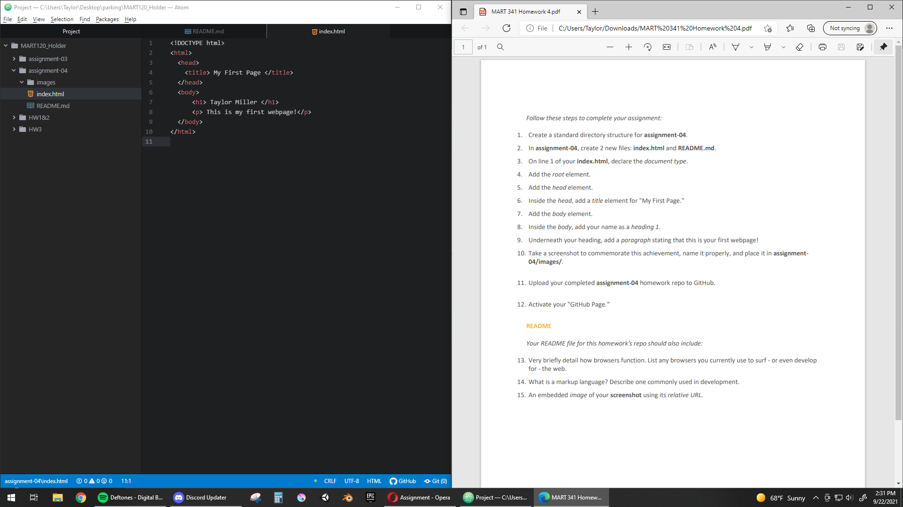

# Assignment 04 README #

## **Browsers** ##

Browsers utilize several main components:

- A network
- Browser Engine
- Render Engine
- User Interface
- Javascript Interpreter
- Data Storage

Browsers use **networks** to navigate websites and coordinate information. When accessed, a browser requests information from a host server for a website. Which server that may be is determined by the DNS-related information of a website (eg the protocol, domain, and path.) Once requested, the server will send this information back to the browser usually in the form of HTML documents.

The **Browser Engine** coordinates information between the **User Interface**, the **Render Engine**, and the server. The User Interface includes most interactable content, while the Render Engine displays the visual information of a website.

The programming of a website will often involve Javascript (a programming language) and the use of temporary storage (**cookies**.) Browsers require a **Javascript Interpreter** to parse this information - each browser uses a different Interpreter.

## **Browsers and Me** ##

My maiden voyages into the digital unknown were made aboard the infamous *Internet Explorer*. It was the only vessel I knew of at the time, and I called it ""*MSN*,"" as that was the homepage set by my parents and I was (and still am) naive.

I used Google Chrome for awhile, but decided to switch to Opera. I prefer the utilities and style of Opera. It also fallaciously soothes the constant worrier in my subconscious to know I am not using the directly-associated browser of our tech overlord.

## **Mark Up Languages** ##

Mark up languages are a text based syntax used to structure webpages. They primarily focus on text-based content - though not exclusively - and are complimented by other documents focused on visual and interactive elements. Essentially, a browser will use a Mark up document to format the layout and function of a website.

The most common mark up language is html. Html has 4 main elements: a declaration of document type, the head, the root, and the body. The structure of an html document is mandatory, including nested tags and closed elements For example, < p> and < /p> are the encapsulating elements used to demarcate a separate paragraph.

