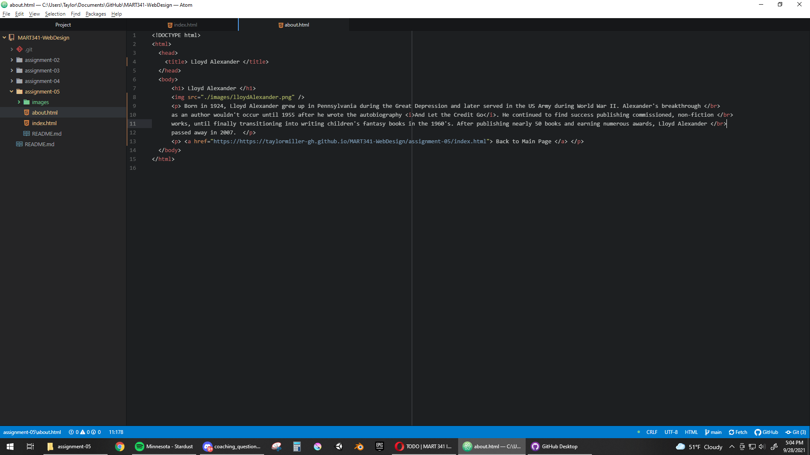

## The Wayback Machine

**1.** I used the Wayback Machine to visit facebook.com around 2001, before it became the social media site we know it as. What I found is that the domain
used to belong to Atlantic Media. The site, called aboutface, was a commercial electronic-directory meant for people who have "...walked down the hall at
your office and greeted a coworker as "hey, there" or "hi, buddy" because you had no idea what their name was." The website had the old, mid-2000's aesthetic:
a basic structural layout lacking any unique graphic design or atmosphere. The site today has had a complete overhaul. However, it still retains the same
fundamental function as an electronic directory.

## Week 4 - 5

**2.** Prior to the last few weeks, I had heard of/seen web development and GitHub, but I had never used them or learned anything about them. After these last
two weeks, I've learned the basics of implementing a website using html, as well as the fundamentals of using GitHub. Neither task was particularly difficult
after being immersed in them for a month - it's all fairly simply and makes sense within its own context. Viewing the source of a webpage earlier this year was
like taking a peek into the matrix. Now a fair amount of the magic has been dispelled and the world is mundane again. I'm especially excited about continuing
extensive use of GitHub, as this seems to be an industry standard that anyone - web devs, software devs, artists, etc. - will encounter (or at least some
version of this practice.) Previously, I had haphazardly used Dropbox, much to all the programmers' chagrin.

**3.** 
